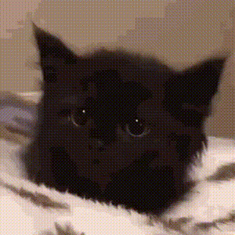

```
                                    ╱|、
                                   (˚ˎ 。7
                                    |、˜〵
                                    じしˍ,)ノ

             ██████╗ ███╗   ███╗ █████╗ ██╗  ██╗
            ██╔═══██╗████╗ ████║██╔══██╗╚██╗██╔╝
            ██║   ██║██╔████╔██║███████║ ╚███╔╝
            ██║▄▄ ██║██║╚██╔╝██║██╔══██║ ██╔██╗
            ╚██████╔╝██║ ╚═╝ ██║██║  ██║██╔╝ ██╗
             ╚══▀▀═╝ ╚═╝     ╚═╝╚═╝  ╚═╝╚═╝  ╚═╝
                             c o d e
```

# qmax-code

**AI-powered terminal agent for QualityMax.** Named after Max, the real cat who inspired it all.

<p align="center">
  
  <br>
  <em>Named after Max, the real cat who inspired it all.</em>
</p>

qmax-code is the LLM brain that orchestrates the open-source [`qmax`](https://github.com/Quality-Max/qmax-local-agent) CLI. It connects to the Claude API, understands your testing intent in natural language, and translates it into structured CLI operations — crawling sites, generating tests, running scripts, reviewing repos.

## How it works

```
  You  →  "test the login flow on staging"
                    │
              qmax-code (Claude API)
                    │
          ┌─────────┼─────────┐
          ▼         ▼         ▼
     qmax crawl  qmax test  qmax test
       start      generate     run
```

qmax-code wraps 20 tool definitions that map 1:1 to `qmax` CLI subcommands. Claude picks the right tools, chains them together, and reports back — all in a colorful terminal with cat personality.

## Install

```bash
curl -sL https://raw.githubusercontent.com/Quality-Max/qmax-code/main/install.sh | bash
```

## Quick start

```bash
# 1. Set your Anthropic API key
export ANTHROPIC_API_KEY=sk-ant-...

# 2. Login to QualityMax (paste your API key from Settings > API Keys)
qmax-code login

# 3. Start using
qmax-code
qmax-code "crawl staging.myapp.com and generate e2e tests"
qmax-code -p "run all tests for project 42"
```

No qmax CLI needed. qmax-code calls the QualityMax API directly.

Get your QualityMax API key at: https://app.qualitymax.io/settings

## Architecture

| File | Purpose |
|------|---------|
| `agent.go` | Claude API agentic loop — tool-use, streaming, conversation history |
| `api_client.go` | Direct HTTP client for QualityMax REST API (standalone mode) |
| `auth.go` | Authentication — API key login, token storage |
| `tools.go` | 20 tool definitions mapping to `qmax` CLI subcommands |
| `terminal.go` | Terminal UI — ASCII banner, colors, tool icons, readline |
| `context.go` | Session context loaded from `~/.qmax/config.json` |
| `main.go` | REPL with slash commands and one-shot mode |

## Available tools

**Tests:** list_test_cases, list_scripts, generate_test_code, run_test, run_tests_batch, check_test_status

**Crawl:** start_crawl, crawl_status, crawl_results, list_crawl_jobs

**Repos:** list_repos, review_repo, repo_coverage, repo_quality

**Import:** import_repo, import_document

**PR:** create_pr

**Local:** read_file, run_command

## Requirements

- Go 1.21+ (for building from source)
- Anthropic API key (`ANTHROPIC_API_KEY`)
- QualityMax account (free at [qualitymax.io](https://qualitymax.io))
- qmax CLI is **optional** — qmax-code works standalone via REST API

## Build

```bash
go build -o qmax-code .
```

## Cat personality

Max is a curious explorer, playful bug hunter, and proud test presenter. The agent channels this energy — helpful, occasionally catty, never forced.

```
  /\_/\
 ( o.o )   "knocks bugs off the table"
  > ^ <    "nine lives, zero regressions"
 /|   |\   "if it fits I sits, if it breaks I test it"
(_|   |_)  meow.
```

---

**Closed-source companion to [qmax-local-agent](https://github.com/Quality-Max/qmax-local-agent) (open-source CLI).**
